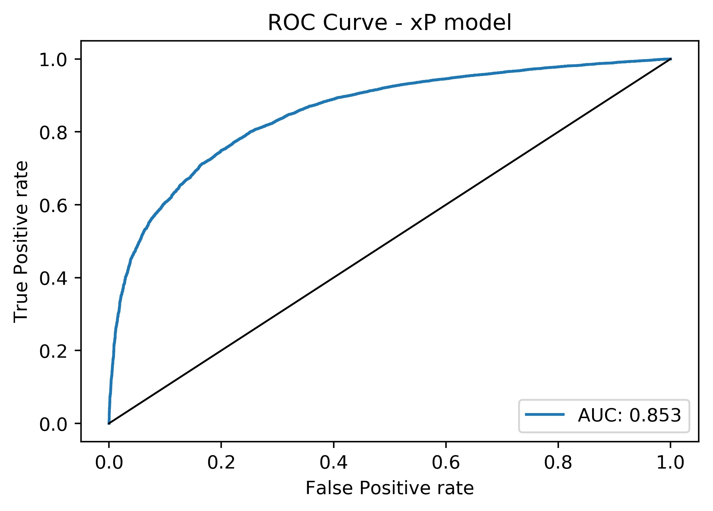

# xP-model

Logistic Regression model to predict pass accuracy in football players.

- Using StatsBomb data for 2018/19 WSL, 2018 NWSL, 2019 Women's World Cup
- Pass accuracy of all passes (n = 128248, open play, excluding GK drop kicks, throws) in dataset: 74.9%
- Model accuracy on test set - 81.9%

- Improvments:
  -variable selection
  -test on 2019/20 WSL data, player evaluation 
